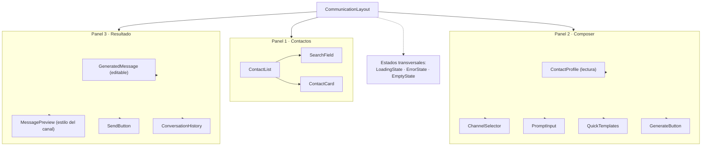
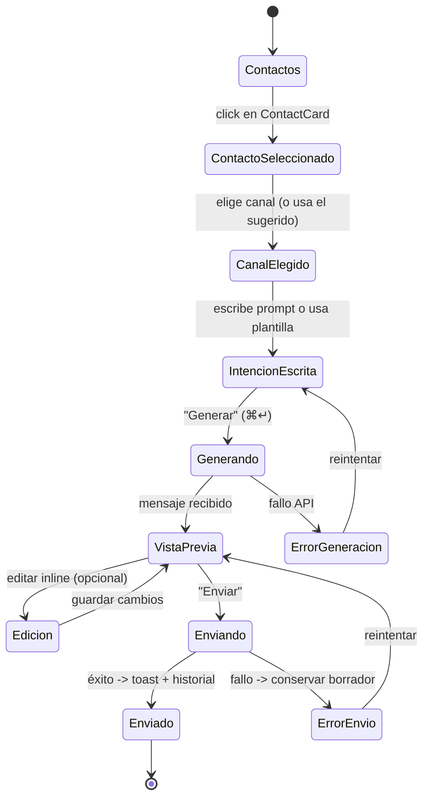
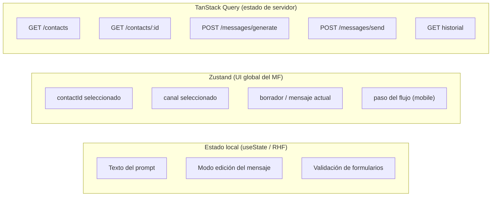
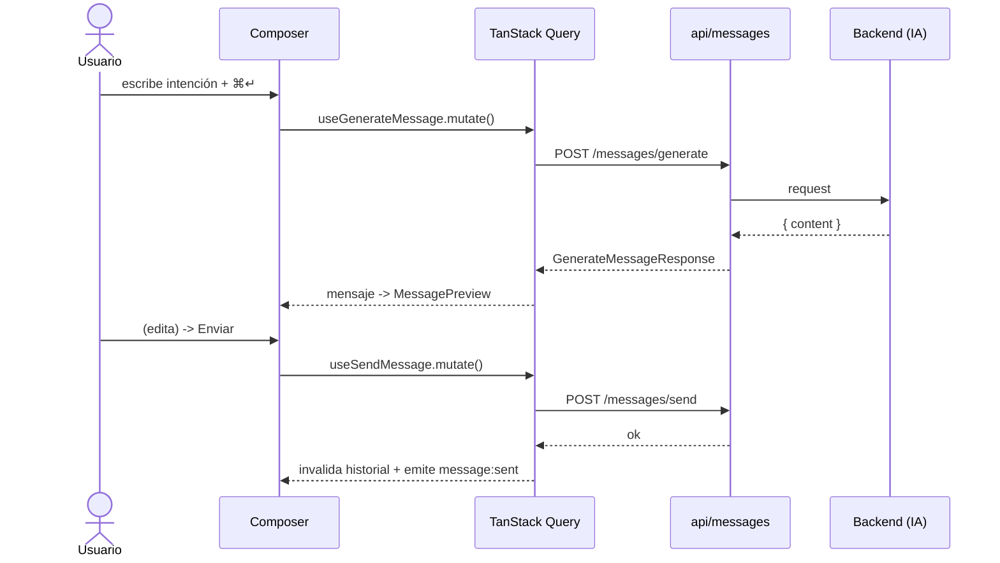
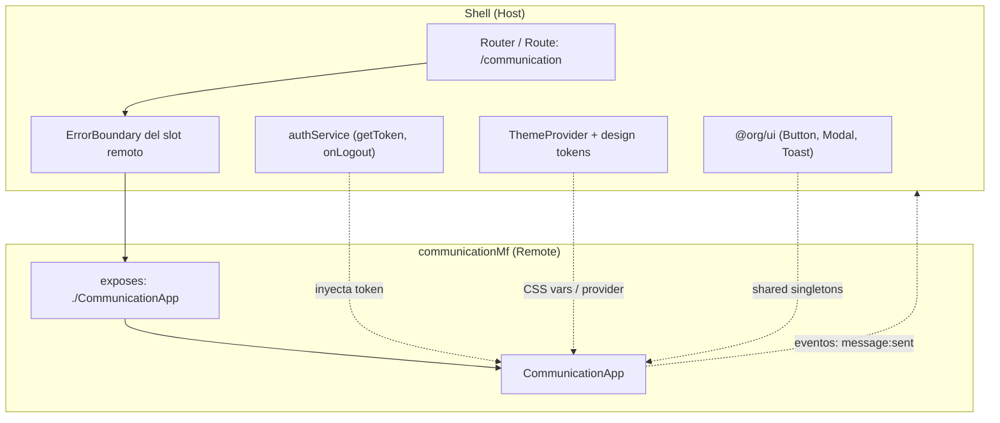

# Microfrontend de Comunicación Inteligente — Arquitectura Frontend

> **Alcance de este documento:** diseño de arquitectura del microfrontend (MF) de comunicación,
> listo para producción, sobre **Next.js + React + TypeScript + Module Federation**.
> No incluye backend ni código completo: se asume que existen APIs para obtener contactos,
> generar mensajes con IA y enviarlos.

**Nombre del remote:** `communicationMf`
**Ruta montada en el Shell:** `/communication`
**Responsable:** equipo de Comunicación / Mensajería

---

## 0. Nota de integración con el proyecto actual

El scaffold de este repositorio (`shell/`, `dashboard/`) usa **Next.js Multi Zones**, que es
el enfoque recomendado por Next.js para microfrontends por rewrites. El brief pide explícitamente
**Module Federation**, que es un modelo distinto: composición **en tiempo de ejecución dentro de una
misma página** (no navegación entre zonas). Este documento diseña el MF para Module Federation.

**Decisión:** el Shell actúa como **host**. El MF de comunicación se expone como **remote** y el Shell
lo monta en `/communication`. Para lograr Module Federation en Next.js App Router se usa
`@module-federation/nextjs-mf` (o, si se prefiere desacoplar de Next, montar el MF como una app
**Vite/React + `@module-federation/enhanced`** embebida). La elección concreta del adaptador se documenta
en la sección 9; el resto de la arquitectura es agnóstica a ese detalle.

---

## 1. Arquitectura del microfrontend

### 1.1 Responsabilidad (una sola frase)

> Permitir que un usuario **seleccione un contacto**, **elija un canal** (Gmail / WhatsApp / Telegram),
> **escriba una intención en lenguaje natural**, y **revise, edite y envíe** el mensaje que la IA genera
> respetando el perfil de comunicación del contacto.

### 1.2 Qué SÍ contiene

- Listado, búsqueda y filtrado de contactos.
- Visualización del **perfil de comunicación** del contacto (tono, idioma, longitud, saludo,
  despedida, emojis, instrucciones personalizadas) en **modo lectura**.
- Selector de canal con estado de conexión por canal.
- Composer de intención (prompt) con plantillas rápidas.
- Orquestación de **generar → previsualizar → editar → enviar**.
- Vista previa del mensaje **con el estilo visual del canal destino**.
- Historial de conversación por contacto/canal (solo lectura).
- Estados de carga, error y vacío propios del módulo.

### 1.3 Qué NO le corresponde

| No es responsabilidad del MF | De quién es |
|---|---|
| Generar el mensaje con IA | Backend |
| Enviar realmente por Gmail/WhatsApp/Telegram | Backend / gateways |
| **Crear o editar** el perfil de comunicación del contacto | MF de Contactos / Ajustes |
| Autenticación / gestión de sesión | Shell (host) |
| Navegación global, layout raíz, topbar | Shell (host) |
| Facturación, administración de usuarios, roles | Otros MFs |
| Persistir tokens de OAuth de los canales | Backend |

> Principio: el MF **consume** el perfil de comunicación pero **no lo administra**. Eso mantiene una
> única fuente de verdad y evita duplicar responsabilidades (SRP a nivel de módulo).

### 1.4 Comunicación con el Shell (resumen)

```mermaid
flowchart LR
  subgraph Host["Shell (Host)"]
    Auth["Auth / Sesión"]
    Theme["Theme tokens"]
    UI["Design System<br/>(Button, Modal, Toast)"]
    Router["Router global"]
  end

  subgraph MF["communicationMf (Remote)"]
    App["CommunicationApp<br/>(entry expuesto)"]
  end

  Router -->|monta en /communication| App
  Auth -->|getToken() / onLogout| App
  Theme -->|CSS vars / ThemeProvider| App
  UI -->|componentes compartidos| App
  App -->|emite eventos: message:sent| Host
```

El detalle de contratos está en la **sección 9**.

---

## 2. Estructura de carpetas

Organización **Feature-First** con una capa transversal (`shared`) y separación estricta entre
UI, lógica de dominio y acceso a datos.

```
communication-mf/
├─ src/
│  ├─ app/                      # Entrypoints y composición de rutas del MF
│  │  ├─ CommunicationApp.tsx   # Componente RAÍZ expuesto por Module Federation
│  │  ├─ providers/             # QueryClientProvider, ThemeBridge, ErrorBoundary raíz
│  │  └─ routes.tsx             # Rutas internas del MF (lazy)
│  │
│  ├─ features/                 # Núcleo: cada feature es autocontenida (Feature-First)
│  │  ├─ contacts/
│  │  │  ├─ components/         # ContactList, ContactCard, ContactProfile...
│  │  │  ├─ hooks/              # useContacts, useContact
│  │  │  └─ index.ts            # API pública de la feature (barrel controlado)
│  │  ├─ composer/
│  │  │  ├─ components/         # ChannelSelector, PromptInput, GeneratedMessage...
│  │  │  ├─ hooks/              # useGenerateMessage, useSendMessage, useComposer
│  │  │  └─ index.ts
│  │  └─ history/
│  │     ├─ components/         # ConversationHistory, MessageBubble
│  │     └─ hooks/              # useConversationHistory
│  │
│  ├─ components/               # UI atómica y reutilizable, SIN lógica de dominio
│  │  ├─ atoms/                 # Button, Input, Badge, Avatar, Spinner
│  │  ├─ molecules/             # SearchField, EmptyState, ErrorState, LoadingState
│  │  └─ feedback/              # Toast bridge, InlineAlert
│  │
│  ├─ layouts/                  # Estructura visual: CommunicationLayout (3 paneles)
│  ├─ hooks/                    # Hooks transversales: useMediaQuery, useDebounce, useHotkeys
│  ├─ services/                 # Lógica de negocio del cliente (orquestación, mapeos)
│  │  └─ message/               # buildGeneratePayload, channelPresenter...
│  ├─ api/                      # Capa de acceso HTTP (transporte puro)
│  │  ├─ httpClient.ts          # cliente fetch/axios + interceptores (auth, errores)
│  │  ├─ contacts.api.ts        # GET /contacts, GET /contacts/:id
│  │  ├─ messages.api.ts        # POST /messages/generate, POST /messages/send
│  │  └─ queryKeys.ts           # factory tipada de query keys
│  ├─ store/                    # Estado de UI global del MF (Zustand)
│  │  └─ composer.store.ts      # contacto/canal/borrador/paso seleccionados
│  ├─ types/                    # Modelos de dominio (Contact, Channel, Message, DTOs)
│  ├─ constants/                # CHANNELS, PROMPT_TEMPLATES, breakpoints, rutas
│  └─ utils/                    # helpers puros (formaters, guards, validators)
│
├─ module-federation.config.ts  # exposes / remotes / shared
├─ tsconfig.json
└─ ARCHITECTURE.md
```

### 2.1 Responsabilidad de cada carpeta

| Carpeta | Responsabilidad | Regla clave |
|---|---|---|
| `app/` | Ensamblar el MF: providers, error boundary raíz, rutas. Aquí vive el **entry** expuesto. | Solo composición, cero lógica de negocio. |
| `features/` | Casos de uso completos y verticales (contacts, composer, history). | Una feature no importa componentes internos de otra; solo su `index.ts`. |
| `components/` | UI reutilizable y **sin dominio** (Atomic Design). | No conoce contactos ni mensajes; recibe props. |
| `layouts/` | Composición espacial de la pantalla (3 paneles / responsive). | No hace fetch. |
| `hooks/` | Hooks transversales sin dominio. | Reutilizables por cualquier feature. |
| `services/` | Reglas de negocio del cliente: construir payloads, presentar por canal, mapear DTO→dominio. | Pura, testeable, sin React. |
| `api/` | Transporte HTTP puro y tipado. | No contiene reglas de negocio ni JSX. |
| `store/` | Estado **de UI** global del MF (efímero). | No cachea datos de servidor (eso es TanStack Query). |
| `types/` | Contratos de dominio y DTOs. | Fuente única de tipos. |
| `constants/` | Valores fijos (canales, plantillas, breakpoints). | Sin lógica. |
| `utils/` | Funciones puras. | Sin side effects. |

> **Separación en tres capas de datos:** `api/` (transporte) → `services/` (negocio) →
> `features/hooks` (React Query / estado). Esto respeta la **D** de SOLID (dependemos de abstracciones,
> no de `fetch` directamente en los componentes).

---

## 3. Componentes

### 3.1 Diagrama de componentes



### 3.2 Responsabilidad de cada componente

| Componente | Tipo (Atomic) | Responsabilidad |
|---|---|---|
| `CommunicationLayout` | Template | Estructura de 3 paneles y su comportamiento responsive. |
| `ContactList` | Organism | Lista virtualizada de contactos; maneja búsqueda/scroll infinito. |
| `SearchField` | Molecule | Input de búsqueda con debounce; controla el filtro. |
| `ContactCard` | Molecule | Fila/tarjeta de un contacto: avatar, nombre, canal por defecto, estado seleccionado. |
| `ContactProfile` | Organism | Muestra el **perfil de comunicación** en solo lectura (tono, idioma, longitud, saludo, despedida, emojis, instrucciones). |
| `ChannelSelector` | Molecule | Elegir Gmail / WhatsApp / Telegram; muestra estado de conexión y canal sugerido por el perfil. |
| `PromptInput` | Molecule | Textarea de intención; atajos (⌘↵ generar); contador; validación con RHF. |
| `QuickTemplates` | Molecule | Chips de intenciones frecuentes ("Agendar reunión", "Seguimiento", "Agradecer") para reducir clics. |
| `GenerateButton` | Atom | Dispara la generación; refleja estado `loading/disabled`. |
| `GeneratedMessage` | Organism | Muestra el mensaje generado y permite **editarlo inline**; botón "Regenerar". |
| `MessagePreview` | Organism | Renderiza el mensaje **con la apariencia del canal** (hilo Gmail, burbuja WhatsApp, burbuja Telegram). Es el elemento distintivo del MF. |
| `SendButton` | Atom/Molecule | Confirma y envía; estado optimista y de éxito/fallo. |
| `ConversationHistory` | Organism | Historial de mensajes previos del contacto en ese canal (solo lectura). |
| `MessageBubble` | Molecule | Unidad visual del historial/preview según canal. |
| `LoadingState` | Molecule | Skeletons/spinners contextuales por panel. |
| `ErrorState` | Molecule | Error accionable con reintento; texto en voz del sistema, no una disculpa. |
| `EmptyState` | Molecule | Invitación a actuar (ej. "Selecciona un contacto para empezar"). |

---

## 4. Flujo de navegación



**Regla UX central:** todo el flujo ocurre **en una sola pantalla de composición** (contacto ·
canal · intención · resultado visibles a la vez en desktop). El "wizard" solo aparece como
progresión implícita en mobile.

---

## 5. Manejo del estado

Tres responsabilidades separadas; cada dato vive en **una sola** capa.



| Capa | Qué guarda | Por qué |
|---|---|---|
| **Local** (`useState` / React Hook Form) | Valor del textarea, modo edición, errores de validación. | Efímero, acoplado a un componente; RHF da validación performante sin re-renders globales. |
| **Zustand** | Contacto/canal seleccionados, borrador actual, paso del flujo. | Estado de **UI** compartido entre 3 paneles; debe sobrevivir a la navegación interna pero **no** es dato de servidor. |
| **TanStack Query** | Contactos, detalle, generación y envío (mutations), historial. | Es **estado de servidor**: caché, dedupe, reintentos, invalidación y estados `isLoading/isError` gratis. |

### 5.1 Zustand vs Redux Toolkit — decisión

**Se elige Zustand.** Justificación:

- **Bundle y acoplamiento:** un MF debe ser ligero. Zustand pesa ~1 kB y no exige Provider ni
  boilerplate; RTK añade store, slices, middleware y un Provider que **compite con el del Host**.
- **Alcance del estado:** aquí el estado global es pequeño (selección + borrador). No hay lógica de
  dominio compleja, time-travel ni middleware que justifiquen RTK.
- **Aislamiento entre MFs:** cada MF crea su **propio store** de Zustand como singleton local; evita
  el riesgo de un store Redux único compartido y colisiones de reducers entre remotes.
- **TanStack Query ya cubre el estado de servidor**, que es donde RTK Query aportaría — pero ese hueco
  ya está resuelto.

> Redux Toolkit sería la elección si el MF creciera a muchos flujos con reglas de negocio en cliente,
> auditoría de acciones o un equipo grande que valore la convención estricta. No es el caso hoy.

---

## 6. Consumo de APIs

Capa `api/` = transporte puro; los hooks de cada feature envuelven con TanStack Query.

### 6.1 Endpoints asumidos

| Método | Endpoint | Uso | Hook |
|---|---|---|---|
| GET | `/contacts` | Lista + búsqueda/paginación | `useContacts` (`useInfiniteQuery`) |
| GET | `/contacts/:id` | Perfil de comunicación | `useContact(id)` |
| POST | `/messages/generate` | Generar mensaje con IA | `useGenerateMessage` (`useMutation`) |
| POST | `/messages/send` | Enviar por el canal | `useSendMessage` (`useMutation`) |
| GET | `/contacts/:id/history?channel=` | Historial | `useConversationHistory` |

### 6.2 Contratos (TypeScript, solo tipos)

```ts
type Channel = 'gmail' | 'whatsapp' | 'telegram';

interface CommunicationProfile {
  tone: 'formal' | 'informal' | 'executive' | 'friendly';
  language: string;              // 'es', 'en'...
  messageLength: 'short' | 'medium' | 'long';
  greeting: string;
  closing: string;
  useEmojis: boolean;
  customInstructions?: string;
}

interface Contact {
  id: string;
  name: string;
  avatarUrl?: string;
  defaultChannel: Channel;
  connectedChannels: Channel[];
  profile: CommunicationProfile;
}

// POST /messages/generate
interface GenerateMessageRequest {
  contactId: string;
  channel: Channel;
  intent: string;               // "Invítalo a la reunión del viernes"
}
interface GenerateMessageResponse {
  messageId: string;
  content: string;              // mensaje listo para revisar
}

// POST /messages/send
interface SendMessageRequest {
  contactId: string;
  channel: Channel;
  content: string;              // el mensaje (editado o no)
}
```

### 6.3 Estrategia de integración

- **`httpClient`** con interceptores: inyecta el **token del Host** en cada request y normaliza errores
  a un `ApiError` tipado. En 401 dispara `onUnauthorized()` provisto por el Shell.
- **`queryKeys` factory** tipada: `['contacts']`, `['contact', id]`, `['history', id, channel]` para
  invalidaciones precisas.
- **Mutations:** al enviar con éxito se **invalida** `['history', id, channel]` y se emite el evento
  `message:sent` al Host. Reintentos automáticos solo en `generate` (idempotente); en `send` **no** se
  reintenta en silencio para no duplicar envíos.
- **Optimistic UI** en el historial al enviar, con rollback ante error.



---

## 7. Diseño UX/UI

Dirección visual: **empresarial, limpia, sin gradientes, sin “estética IA”.** Precisión en espaciado,
tipografía y jerarquía; un único color de marca + neutros; los colores de canal solo como puntos/insignias
semánticas. El detalle visual está en el **mockup** (artifact) que acompaña a este documento.

### 7.1 Layout de referencia (desktop)

```
┌───────────────┬─────────────────────────┬────────────────────────┐
│  CONTACTOS    │  COMPOSER                │  RESULTADO             │
│  [buscar…]    │  Perfil (solo lectura)   │  Vista previa (canal)  │
│  ● Ana R.     │  Canal: ○Gmail ●WA ○TG   │  ┌──────────────────┐  │
│  ○ Luis M.    │  Intención:              │  │ burbuja/hilo del │  │
│  ○ Carla P.   │  [ Invítalo a la… ]      │  │ canal destino    │  │
│               │  Plantillas: [Reunión]…  │  └──────────────────┘  │
│               │  [ Generar  ⌘↵ ]         │  [ Editar ] [ Enviar ] │
└───────────────┴─────────────────────────┴────────────────────────┘
```

### 7.2 Elemento distintivo (signature)

La **vista previa contextual por canal**: el mensaje se muestra con la apariencia real del destino
(hilo de correo para Gmail, burbuja verde para WhatsApp, burbuja azul para Telegram). Es útil (el usuario
ve cómo llegará) y es propio del dominio multicanal, no un adorno.

### 7.3 Mejoras para reducir clics

1. **Canal por defecto** tomado del perfil del contacto → el usuario no elige salvo que quiera cambiarlo.
2. **Todo en una pantalla** (sin wizard en desktop).
3. **Plantillas rápidas** (chips) que rellenan la intención con un click.
4. **Atajos de teclado:** `⌘/Ctrl+↵` generar, `⌘/Ctrl+⇧+↵` enviar, `/` enfocar búsqueda.
5. **Edición inline** del mensaje generado (sin “modo editar” aparte).
6. **Regenerar** conservando la intención, con opción de “más corto / más formal”.
7. **Command palette** para saltar a un contacto por nombre.

### 7.4 Copy (voz de la interfaz)

- Acción consistente extremo a extremo: el botón dice **“Enviar”** y el toast dice **“Mensaje enviado”**.
- Vacío como invitación: *“Selecciona un contacto para redactar tu primer mensaje.”*
- Error accionable, sin disculpas: *“No se pudo generar el mensaje. Revisa la conexión e inténtalo de nuevo.”*

---

## 8. Diseño responsive

Basado en la disponibilidad de espacio, no en dispositivos concretos.

| Breakpoint | Layout | Comportamiento |
|---|---|---|
| **Desktop ≥ 1024px** | 3 paneles simultáneos (master–detail–preview). | Flujo sin cambios de pantalla; máxima productividad. |
| **Tablet 640–1023px** | 2 paneles: lista como **rail/drawer** colapsable + composer y preview apilados o en pestañas. | La lista se oculta tras seleccionar; botón para reabrirla. |
| **Mobile < 640px** | 1 columna, **flujo por pasos** (stepper): Contacto → Canal → Intención → Preview. | Canal en **bottom sheet**; barra de acción **sticky** abajo; preview a pantalla completa. |

Técnica: contenedores fluidos con CSS Grid, `container queries` donde aplique, `useMediaQuery` para
decidir el modo de layout, y **un solo árbol de componentes** que se recompone (no dos apps distintas).

---

## 9. Comunicación con el Shell (Module Federation)

### 9.1 Diagrama de integración



### 9.2 Qué EXPONE el MF

```ts
// module-federation.config.ts (conceptual)
exposes: {
  './CommunicationApp': './src/app/CommunicationApp.tsx', // entry montable
  './routes':           './src/app/routes.tsx',           // opcional, para el router del host
}
```

- `CommunicationApp`: recibe por props un **contrato de contexto** del host y monta todo el MF.

```ts
interface HostContext {
  getToken: () => Promise<string>;
  onUnauthorized: () => void;
  theme: 'light' | 'dark';
  locale: string;
  onEvent?: (e: { type: 'message:sent'; contactId: string; channel: Channel }) => void;
}
```

### 9.3 Qué CONSUME del Host

- **Autenticación:** el MF **no** guarda credenciales. Consume `getToken()` del host (o un remote
  `host/authService`) y lo inyecta en el `httpClient`. En 401 llama `onUnauthorized()`.
- **Tema:** el host expone **design tokens como CSS variables** (`--color-brand`, `--radius`, …) y/o un
  `ThemeProvider` compartido; el MF **solo** los consume, nunca define su propia paleta. Cambio de tema
  = reactivo vía la prop `theme`/CSS vars.
- **Componentes globales:** `Button`, `Modal`, `Toast`, iconografía desde un paquete `@org/ui` marcado
  como **shared singleton** para no duplicarlo ni romper el contexto de portales/toasts.

### 9.4 Dependencias compartidas (`shared`)

```ts
shared: {
  react:            { singleton: true, requiredVersion: '^18' },
  'react-dom':      { singleton: true, requiredVersion: '^18' },
  '@org/ui':        { singleton: true },
  // TanStack Query: singleton para reutilizar un QueryClient del host si existe;
  // si el MF debe ser 100% autónomo, mantiene su propio QueryClient (ver nota).
  '@tanstack/react-query': { singleton: true, requiredVersion: '^5' },
}
// Zustand NO se comparte: cada MF mantiene su store aislado.
```

> **Nota de aislamiento:** el MF envuelve su entry en su propio `QueryClientProvider` y `ErrorBoundary`
> para poder ejecutarse **solo** (dev/standalone) o **embebido**. Si el host ya provee QueryClient, se
> reutiliza; si no, el MF crea el suyo. Así se cumple *“independiente pero componible”*.

### 9.5 Contrato de eventos (MF → Host)

- `message:sent` → el host puede refrescar notificaciones, métricas del dashboard, etc.
- Comunicación **sin acoplar**: callbacks por props (`onEvent`) o un **event bus** ligero provisto por
  el host. Nunca imports directos entre remotes.

---

## 10. Buenas prácticas aplicadas

| Principio | Cómo se materializa aquí |
|---|---|
| **SOLID – SRP** | Capas `api` / `services` / `hooks` / `components` separadas; cada feature una responsabilidad. |
| **SOLID – DIP** | Los componentes dependen de hooks/servicios (abstracciones), no de `fetch` ni de axios directo. |
| **SOLID – OCP** | Nuevos canales = añadir entrada en `constants/CHANNELS` + un presenter; sin tocar el composer. |
| **Atomic Design** | `atoms` → `molecules` → `organisms` en `components/` y dentro de cada feature. |
| **Feature-First** | `features/{contacts,composer,history}` autocontenidas con API pública por `index.ts`. |
| **Reutilización** | `components/` sin dominio, consumibles por cualquier feature. |
| **Lazy Loading / Code Splitting** | `routes.tsx` con `React.lazy`; `history` y `preview` cargan bajo demanda; el remote entero se carga solo al entrar a `/communication`. |
| **Error Boundaries** | Boundary raíz del MF + boundary alrededor del slot remoto en el host (aísla fallos del MF). |
| **Suspense** | `Suspense` para carga de rutas y datos con fallback = `LoadingState`. |
| **Accesibilidad (WCAG 2.1 AA)** | Labels asociados, foco visible, contraste AA, navegación por teclado, `aria-live="polite"` al aparecer el mensaje generado, `prefers-reduced-motion` respetado. |
| **Rendimiento** | Lista de contactos virtualizada, `debounce` en búsqueda, memoización selectiva, `useInfiniteQuery`. |
| **Tipado estricto** | `types/` como fuente única; DTOs ≠ modelos de dominio (mapeo en `services`). |

---

## Apéndice · Resumen de decisiones técnicas

| Decisión | Elección | Motivo principal |
|---|---|---|
| Estado de servidor | **TanStack Query** | Caché, reintentos e invalidación sin boilerplate. |
| Estado de UI global | **Zustand** | Ligero, sin Provider, aislado por MF. |
| Formularios | **React Hook Form** | Validación performante sin re-renders globales. |
| Composición de MFs | **Module Federation** (host = Shell) | Composición en runtime en una misma vista. |
| Estilos | **Tailwind + design tokens del host** | Rapidez + consistencia visual con el Shell, sin duplicar paleta. |
| Perfil de comunicación | **Solo lectura** en este MF | Única fuente de verdad; SRP a nivel de módulo. |
```
